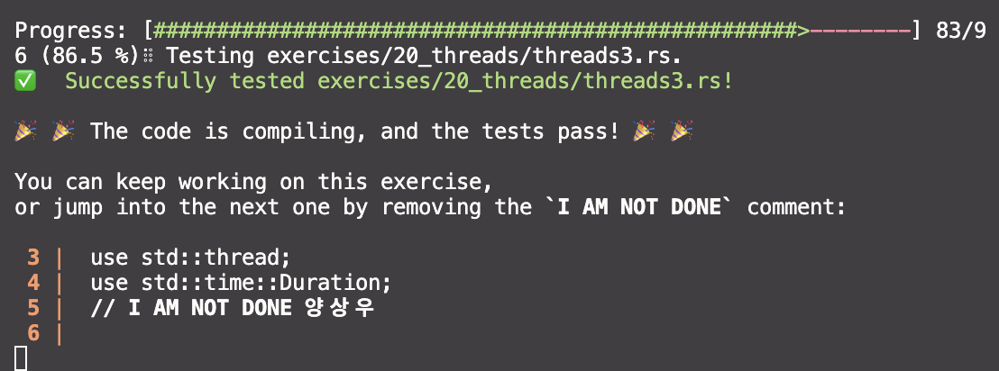

# 포인터

- 포인터 메모리의 주솟값을 담고 있는 변수
- 주솟값에는 어떤 다른 데이터를 참조, 즉 가리킨다.
- 참조자는 & 심볼로 표시, 이들이 가르키고 있는 값을 빌려온다.

# 스마트 포인터

- 포인터 + 추가적인 메타데이터와 능력을 가지는 데이터 구조
- 참조자는 데이터를 빌리기만 하는 반면, 스마트 포인터는 가르킨 데이터를 소유한다.
- 보통 구조체를 이영하여 구현되어있음
- Deref, Drop 트레이트를 구현
  - Deref : 스마트 포인터 구조체의 인스턴스가 참조자 처럼 동작하도록 하여, 참조자 혹은 스마트 포인터와 ㅎ마께 작동하는 코드를 작성할 수 있도록 해줌
  - Drop : 스마트 포인터의 인스턴스가 스코프 밖으로 벗어났을 때 실행된느 코드를 커스터마이징하게 해줌

## 일반적인 스마트 포인터

- 값을 힙에 할당하기 위한 `Box<T>`
- 복수 소유권을 가능하게 하는 참조 카운팅 타입인 `Rc<T>`
- 대여 규칙을 컴파일 타임 대신 런타임에 강제하는 타입인, `RefCell<T>`를 통해 접근 가능한 `Ref<T>`와 `RefMut<T>`

---

# 1. [**`Box<T>`를 사용하여 힙에 있는 데이터 가리키기**](https://doc.rust-kr.org/ch15-01-box.html#boxt%EB%A5%BC-%EC%82%AC%EC%9A%A9%ED%95%98%EC%97%AC-%ED%9E%99%EC%97%90-%EC%9E%88%EB%8A%94-%EB%8D%B0%EC%9D%B4%ED%84%B0-%EA%B0%80%EB%A6%AC%ED%82%A4%EA%B8%B0)

> 스는 스택이 아니라 힙에 데이터를 저장

- 컴파일 타임에는 크기를 알 수 없는 타입이 있는데, 정확한 크기를 요구하는 컨텍스트 내에서 그 타입의 값을 사용하고 싶을 때
- 커다란 데이터를 가지고 있고 소유권을 옮기고 싶지만 그렇게 했을 때 데이터가 복사되지 않을 것을 보장하고 싶을 때 ⇒ 방대한 양의 데이터의 소유권을 옮기기는 긴 시간이 소요될수 있기에
- 어떤 값을 소유하고 이 값의 구체화된 타입보다는 특정 트레이트를 구현한 타입이라는 점만 신경 쓰고 싶을 때

## [**`Box<T>`을 사용하여 힙에 데이터 저장하기**](https://doc.rust-kr.org/ch15-01-box.html#boxt%EC%9D%84-%EC%82%AC%EC%9A%A9%ED%95%98%EC%97%AC-%ED%9E%99%EC%97%90-%EB%8D%B0%EC%9D%B4%ED%84%B0-%EC%A0%80%EC%9E%A5%ED%95%98%EA%B8%B0)

```rust
fn main() {
    let b = Box::new(5);
    println!("b = {}", b);
}
```

## [박스로 재귀적 타입 가능하게 하기](https://doc.rust-kr.org/ch15-01-box.html#%EB%B0%95%EC%8A%A4%EB%A1%9C-%EC%9E%AC%EA%B7%80%EC%A0%81-%ED%83%80%EC%9E%85-%EA%B0%80%EB%8A%A5%ED%95%98%EA%B2%8C-%ED%95%98%EA%B8%B0)

- *재귀적 타입 (recursive type)* 의 값은 자신 안에 동일한 타입의 또 다른 값을 담을 수 있습니다.
- 재귀적 타입의 값 중첩은 이론적으로 무한히 계속될 수 있으므로, 러스트는 이 값에 얼마만큼의 공간이 필요한지 알 수 없습니다.
- 박스는 알려진 크기를 갖고 있으므로, 재귀적 타입의 정의에 박스를 집어넣어서 재귀적 타입을 가능하게 할 수 있습니다.

### 콘스 리스트에 대한 더 많은 정보

콘스 리스트(Cons list)는 Lisp 프로그래밍 언어에서 유래된 데이터 구조로, 중첩된 쌍으로 구성된 연결 리스트입니다. cons 함수는 두 개의 인수로부터 새로운 쌍을 생성하며, 이를 통해 재귀적인 쌍으로 이루어진 콘스 리스트를 구성할 수 있습니다. 예를 들어, 리스트 `[1, 2, 3]`을 콘스 리스트로 표현하면 `(1, (2, (3, Nil)))`처럼 나타낼 수 있습니다.

```rust
enum List {
    Cons(i32, List),
    Nil,
}

```

### 왜 이 코드가 컴파일되지 않는가?

러스트는 각 타입의 크기를 알아야 합니다. 그런데 `List` 타입은 스스로를 참조하기 때문에, 크기를 결정할 수 없습니다.

```rust
enum List {
    Cons(i32, List),  // 여기서 List는 또 다른 List를 가지고 있습니다.
    Nil,
}

```

위 코드에서 `Cons`는 `i32`와 또 다른 `List`를 포함합니다. 그런데 그 `List`도 다시 `i32`와 또 다른 `List`를 포함하고, 이 과정이 무한히 반복됩니다. 그래서 러스트는 이 타입이 얼마나 큰지 알 수 없고, "무한한 크기"를 가지게 됩니다.

### 해결책: 포인터(Box<T>) 사용

이 문제를 해결하기 위해, 재귀적 타입을 포인터(`Box<T>`)를 사용해 감싸줍니다. 포인터를 사용하면, 리스트의 다음 노드가 직접 포함되는 것이 아니라, 힙에 저장된 다음 노드를 가리키는 간접 참조를 포함하게 됩니다. 이렇게 하면 포인터 자체의 크기는 고정되어 있으므로, 러스트가 타입의 크기를 계산할 수 있습니다.

콘스 리스트를 구현하는 예제 코드는 다음과 같습니다:

```rust
enum List {
    Cons(i32, Box<List>),
    Nil,
}

use crate::List::{Cons, Nil};

fn main() {
    let list = Cons(1, Box::new(Cons(2, Box::new(Cons(3, Box::new(Nil))))));
      // list는 1을 가지고 있고, 다음 노드를 가리키는 Box 포인터가 있으며,
    // 그 다음 노드는 2를 가지고 있고, 또 다른 노드를 가리키는 Box 포인터가 있습니다.
}

```

이제 `List`는 고정된 크기를 가지며, 각 노드는 `i32` 값과 `Box` 포인터를 포함합니다. `Box` 포인터는 힙에 저장된 다음 노드를 가리키기 때문에, 재귀적 타입을 안전하게 정의할 수 있습니다.

포인터를 사용함으로써, 컴파일러가 `List` 타입의 크기를 결정할 수 있게 되고, 이를 통해 재귀적 데이터 구조를 안전하게 사용할 수 있게 되는 것입니다.


`Box<T>`는 간접적인 포인터로서 힙에 데이터를 저장하고, `Deref`와 `Drop` 트레이트를 구현하여 참조자처럼 동작하며, 스코프를 벗어날 때 힙 데이터를 정리합니다. 이를 통해 콘스 리스트와 같은 재귀적 데이터 구조를 러스트에서 효율적으로 구현할 수 있습니다.

```rust
enum List {
    Cons(i32, Box<List>),
    Nil,
}

```

여기서 `Box<List>`는 다음 노드에 대한 참조를 가리키는 포인터입니다. 이제 `List`는 재귀적으로 정의될 수 있으며, 크기도 고정되어 있습니다.

---

# 2. [**`Deref`(역참조) 트레이트로 스마트 포인터를 보통의 참조자처럼 취급하기**](https://doc.rust-kr.org/ch15-02-deref.html#deref-%ED%8A%B8%EB%A0%88%EC%9D%B4%ED%8A%B8%EB%A1%9C-%EC%8A%A4%EB%A7%88%ED%8A%B8-%ED%8F%AC%EC%9D%B8%ED%84%B0%EB%A5%BC-%EB%B3%B4%ED%86%B5%EC%9D%98-%EC%B0%B8%EC%A1%B0%EC%9E%90%EC%B2%98%EB%9F%BC-%EC%B7%A8%EA%B8%89%ED%95%98%EA%B8%B0)

### Deref 트레이트로 스마트 포인터를 참조자처럼 취급하기

`Deref` 트레이트를 구현하면 역참조 연산자(`*`)의 동작을 커스터마이징할 수 있습니다. 이를 통해 스마트 포인터가 보통의 참조자처럼 동작하게 하여, 참조자로 작동하도록 작성된 코드가 스마트 포인터에도 사용될 수 있습니다.

### 기본 참조자와 역참조 연산자

먼저, 기본 참조자와 역참조 연산자의 사용을 이해해야 합니다. 예를 들어:

```rust
fn main() {
    let x = 5;
    let y = &x;

    assert_eq!(5, x);
    assert_eq!(5, *y);
}

```

여기서 `y`는 `x`에 대한 참조자입니다. `*y`를 사용하여 `y`가 가리키는 값을 얻을 수 있습니다.

# 참조자와 불변참조자

### 참조자(`&`)

참조자는 어떤 값의 주소를 가리키는 포인터입니다. 참조자를 사용하면 값 자체를 복사하지 않고도 값을 읽거나 쓸 수 있습니다. 참조자는 두 가지 종류가 있습니다: 불변 참조자(`&T`)와 가변 참조자(`&mut T`).

### 불변 참조자 (`&T`)

불변 참조자는 값의 변경 없이 값을 읽을 수 있게 합니다.

```rust
fn main() {
    let x = 5;
    let y = &x;  // y는 x의 불변 참조자입니다.

    assert_eq!(5, *y);  // y를 역참조하여 x의 값을 얻습니다.
}

```

### 가변 참조자 (`&mut T`)

가변 참조자는 값을 변경할 수 있게 합니다.

```rust
fn main() {
    let mut x = 5;
    let y = &mut x;  // y는 x의 가변 참조자입니다.

    *y += 1;  // y를 역참조하여 x의 값을 변경합니다.
    assert_eq!(6, x);
}

```

# 역참조

### 역참조 연산자(`*`)

역참조 연산자는 참조자가 가리키는 실제 값을 얻거나 수정할 때 사용합니다. 예를 들어, 참조자(`&T` 또는 `&mut T`)에서 값을 얻으려면 역참조 연산자(`*`)를 사용합니다.

### 불변 참조자의 역참조 (`*`)

불변 참조자의 경우, 역참조 연산자는 값을 읽기 위해 사용됩니다.

```rust
fn main() {
    let x = 5;
    let y = &x;

    // *y는 y가 가리키는 값을 의미합니다.
    assert_eq!(5, *y);
}

```

### 가변 참조자의 역참조 (`*`)

가변 참조자의 경우, 역참조 연산자는 값을 읽거나 수정하기 위해 사용됩니다.

```rust
fn main() {
    let mut x = 5;
    let y = &mut x;

    // *y를 통해 x의 값을 수정합니다.
    *y += 1;
    assert_eq!(6, *y);
}

```

### Box<T>를 사용하여 값 참조하기

기본 참조자 대신 `Box<T>`를 사용하여 같은 작업을 할 수 있습니다:

```rust
fn main() {
    let x = 5;
    let y = Box::new(x);

    assert_eq!(5, x);
    assert_eq!(5, *y);
}

```

여기서 `Box<T>`는 힙에 데이터를 저장하는 스마트 포인터입니다. `*y`를 사용하여 박스가 가리키는 값을 얻을 수 있습니다.

### 커스텀 스마트 포인터 만들기

이제 `Box<T>`와 비슷한 커스텀 스마트 포인터 `MyBox<T>`를 만들어 보겠습니다:

```rust
struct MyBox<T>(T);

impl<T> MyBox<T> {
    fn new(x: T) -> MyBox<T> {
        MyBox(x)
    }
}

```

위의 `MyBox<T>`는 `Box<T>`와 비슷하지만, 이 타입은 아직 역참조 연산자를 사용할 수 없습니다. 이를 위해 `Deref` 트레이트를 구현해야 합니다.

### Deref 트레이트 구현하기

`Deref` 트레이트를 구현하면 `MyBox<T>`를 역참조 연산자로 사용할 수 있습니다:

```rust
use std::ops::Deref;

impl<T> Deref for MyBox<T> {
    type Target = T;

    fn deref(&self) -> &Self::Target {
        &self.0
    }
}

```

이제 `MyBox<T>` 타입을 역참조 연산자로 사용할 수 있습니다:

```rust
fn main() {
    let x = 5;
    let y = MyBox::new(x);

    assert_eq!(5, x);
    assert_eq!(5, *y);
}

```

### 역참조 강제 변환 (Deref Coercion)

역참조 강제 변환은 러스트가 함수나 메서드 호출 시 `Deref` 트레이트를 사용하여 자동으로 참조자를 변환해주는 기능입니다. 예를 들어 `&MyBox<String>`을 `&str`로 변환할 수 있습니다.

역참조 강제 변환은 러스트가 함수와 메서드의 인수에 대해 수행해 주는 편의성 기능이고, `Deref` 트레이트를 구현한 타입에 대해서만 동작합니다. 이는 어떤 특정한 타입값에 대한 참조자를 함수 혹은 메서드의 인수로 전달하는데 이 함수나 메서드의 정의에는 그 매개변수 타입이 맞지 않을 때 자동으로 발생합니다.

```rust
fn hello(name: &str) {
    println!("Hello, {name}!");
}

fn main() {
    let m = MyBox::new(String::from("Rust"));
    hello(&m);
}

```

여기서 `hello` 함수는 `&str`을 매개변수로 받습니다. `MyBox<String>` 타입의 값을 `hello` 함수에 전달하면, 러스트는 자동으로 `&MyBox<String>`을 `&String`으로, 다시 `&str`로 변환합니다.

### 가변 참조자에 대한 DerefMut 트레이트

`DerefMut` 트레이트를 구현하면 가변 참조자(`&mut T`)에 대한 역참조 연산자(`*`)를 사용할 수 있습니다. 러스트는 다음의 세 가지 경우에 역참조 강제 변환을 수행합니다:

1. `T: Deref<Target=U>`일 때 `&T`에서 `&U`로
2. `T: DerefMut<Target=U>`일 때 `&mut T`에서 `&mut U`로
3. `T: Deref<Target=U>`일 때 `&mut T`에서 `&U`로 (불변 참조자로 변환)

이 세 가지 경우를 통해, 불변 참조자와 가변 참조자를 모두 유연하게 사용할 수 있습니다.

---

### Drop 트레이트로 메모리 정리 코드 실행하기

`Drop` 트레이트는 값이 스코프 밖으로 벗어날 때 실행되는 코드를 정의할 수 있게 해줍니다. 이를 통해 파일, 네트워크 연결 등 자원을 해제할 수 있습니다. 특히, 스마트 포인터에서 `Drop` 트레이트를 구현하면 메모리 정리나 자원 해제 작업을 자동으로 처리할 수 있습니다.

### 기본 사용법

다음은 `Drop` 트레이트를 구현한 `CustomSmartPointer` 구조체 예제입니다:

```rust
struct CustomSmartPointer {
    data: String,
}

impl Drop for CustomSmartPointer {
    fn drop(&mut self) {
        println!("Dropping CustomSmartPointer with data `{}`!", self.data);
    }
}

fn main() {
    let c = CustomSmartPointer {
        data: String::from("my stuff"),
    };
    let d = CustomSmartPointer {
        data: String::from("other stuff"),
    };
    println!("CustomSmartPointers created.");
}

```

여기서 `CustomSmartPointer`는 `data`라는 문자열을 담고 있으며, `Drop` 트레이트를 구현하여 인스턴스가 스코프 밖으로 벗어날 때 `drop` 메서드를 호출합니다.

프로그램을 실행하면 다음과 같은 출력을 얻습니다:

```
CustomSmartPointers created.
Dropping CustomSmartPointer with data `other stuff`!
Dropping CustomSmartPointer with data `my stuff`!

```

변수들은 생성된 역순으로 버려지므로, `d`가 `c`보다 먼저 버려집니다.

### 수동으로 Drop 실행하기

가끔은 값을 스코프가 끝나기 전에 일찍 버려야 할 때가 있습니다. 이를 위해 `std::mem::drop` 함수를 사용할 수 있습니다. ( 명시적 호출은 허용하지 않음)

```rust
fn main() {
    let c = CustomSmartPointer {
        data: String::from("some data"),
    };
    println!("CustomSmartPointer created.");
    drop(c); // c.drop() 이 아님, 명시적으로 호출하는걸 허용하지 않음
    println!("CustomSmartPointer dropped before the end of main.");
}

```

이 코드를 실행하면 다음과 같은 출력을 얻습니다:

```
CustomSmartPointer created.
Dropping CustomSmartPointer with data `some data`!
CustomSmartPointer dropped before the end of main.

```

---

### Rc<T>: 참조 카운트 스마트 포인터

`Rc<T>`는 Rust에서 여러 소유자가 같은 값을 공유할 수 있도록 하는 스마트 포인터입니다. 이는 "Reference Counting"의 약자로, 참조 카운트를 통해 값이 여전히 사용 중인지 추적합니다. 참조 카운트가 0이 되면 값의 메모리를 정리합니다.

### 기본 사용법


### 예제: 하나의 값이 여러 소유자를 가지는 경우

하나의 값을 여러 소유자가 공유하는 예를 들어 봅시다. 콘스 리스트를 사용하여 여러 리스트가 동일한 노드를 공유하도록 하는 예제입니다.

```rust
enum List {
    Cons(i32, Rc<List>),
    Nil,
}

use std::rc::Rc;
use crate::List::{Cons, Nil};

fn main() {
    let a = Rc::new(Cons(5, Rc::new(Cons(10, Rc::new(Nil)))));
    let b = Cons(3, Rc::clone(&a));
    let c = Cons(4, Rc::clone(&a));
}

```

여기서 `a` 리스트는 `Rc::new`로 생성되고, `b`와 `c` 리스트는 `Rc::clone`을 사용하여 `a`의 참조를 공유합니다. `Rc::clone`은 참조 카운트를 증가시키고, 이는 값이 여전히 사용 중임을 나타냅니다.

### 참조 카운트 확인하기

다음은 참조 카운트를 확인하는 예제입니다:

```rust
fn main() {
    let a = Rc::new(Cons(5, Rc::new(Cons(10, Rc::new(Nil)))));
    println!("count after creating a = {}", Rc::strong_count(&a));
    let b = Cons(3, Rc::clone(&a));
    println!("count after creating b = {}", Rc::strong_count(&a));
    {
        let c = Cons(4, Rc::clone(&a));
        println!("count after creating c = {}", Rc::strong_count(&a));
    }
    println!("count after c goes out of scope = {}", Rc::strong_count(&a));
}

```

이 코드를 실행하면 다음과 같은 출력을 얻습니다:

```
count after creating a = 1
count after creating b = 2
count after creating c = 3
count after c goes out of scope = 2

```

여기서 `Rc::strong_count` 함수는 참조 카운트를 반환합니다. `Rc<T>`의 참조 카운트는 `Rc::clone`을 호출할 때마다 증가하고, 스코프를 벗어날 때 자동으로 감소합니다.

### Rc<T>의 특징

- **참조 카운팅**: `Rc<T>`는 여러 소유자가 동일한 값을 공유할 수 있도록 참조 카운트를 관리합니다.
- **읽기 전용**: `Rc<T>`는 불변 참조자를 통해 데이터의 읽기 전용 공유를 지원합니다. 여러 가변 참조자를 허용하지 않으므로 데이터 경합을 방지합니다.
- **싱글스레드**: `Rc<T>`는 싱글스레드 환경에서 사용됩니다. 멀티스레드 환경에서는 `Arc<T>`를 사용해야 합니다.

### Rc<T>와 내부 가변성 (Interior Mutability)

`Rc<T>`는 읽기 전용 참조자만 허용하지만, `RefCell<T>`를 사용하여 내부 가변성을 추가할 수 있습니다. 이는 데이터를 안전하게 변형할 수 있도록 합니다. 내부 가변성에 대해서는 다음 절에서 더 자세히 다루겠습니다.

### 요약

- **Rc<T>**: 참조 카운트 스마트 포인터로, 여러 소유자가 동일한 값을 공유할 수 있습니다.
- **참조 카운트**: `Rc::clone`을 사용하여 참조 카운트를 증가시키고, 스코프를 벗어나면 참조 카운트가 자동으로 감소합니다.
- **싱글스레드 전용**: `Rc<T>`는 싱글스레드 환경에서만 사용되며, 멀티스레드 환경에서는 `Arc<T>`를 사용합니다.
- **읽기 전용**: `Rc<T>`는 불변 참조자를 통해 데이터를 공유합니다. 내부 가변성을 위해서는 `RefCell<T>`와 함께 사용해야 합니다.

### 러스트에서 스레드를 이용한 동시성 프로그래밍

현대 운영 체제에서는 프로그램이 동시에 여러 작업을 수행할 수 있는 기능을 제공합니다. 이러한 기능을 **스레드**라고 부르며, 이를 활용하면 성능을 크게 향상시킬 수 있습니다. 그러나 스레드를 사용하는 것은 프로그램을 복잡하게 만들 수 있으며, 동시성 관련 문제들을 일으킬 수 있습니다. 대표적인 문제로는 **경합 조건**(race condition), **데드락**(deadlock), 그리고 **재현하기 어려운 버그**들이 있습니다.

러스트는 이러한 문제를 해 결하기 위해, 안전하고 효율적인 동시성 프로그래밍을 가능하게 하는 기능을 제공합니다.

### 스레드 생성하기

러스트에서 스레드를 생성하기 위해서는 `thread::spawn` 함수를 사용합니다. 이 함수는 클로저(익명 함수)를 인자로 받아 새로운 스레드에서 실행할 코드를 정의합니다. 예를 들어, 다음 코드에서는 메인 스레드와 새로 생성된 스레드가 동시에 서로 다른 메시지를 출력합니다.

```rust
rust코드 복사
use std::thread;
use std::time::Duration;

fn main() {
    thread::spawn(|| {
        for i in 1..10 {
            println!("hi number {} from the spawned thread!", i);
            thread::sleep(Duration::from_millis(1));
        }
    });

    for i in 1..5 {
        println!("hi number {} from the main thread!", i);
        thread::sleep(Duration::from_millis(1));
    }
}

```

이 코드에서는 메인 스레드와 새로 생성된 스레드가 각자 다른 메시지를 출력합니다. 출력 순서는 매번 달라질 수 있으며, 이 점이 동시성 프로그래밍의 본질적인 특징입니다.

### 스레드 완료 대기하기 (Join)

위의 코드에서는 메인 스레드가 종료되면 새로 ㅅ도 함께 종료될 수 있습니다. 이를 방지하기 위해, `JoinHandle`을 사용하여 새로 생성된 스레드가 완료될 때까지 메인 스레드가 대기하도록 할 수 있습니다.

```rust
rust코드 복사
use std::thread;
use std::time::Duration;

fn main() {
    let handle = thread::spawn(|| {
        for i in 1..10 {
            println!("hi number {} from the spawned thread!", i);
            thread::sleep(Duration::from_millis(1));
        }
    });

    for i in 1..5 {
        println!("hi number {} from the main thread!", i);
        thread::sleep(Duration::from_millis(1));
    }

    handle.join().unwrap();
}

```

`handle.join()`을 호출하면, 메인 스레드는 새로 생성된 스레드가 종료될 때까지 대기하게 됩니다. 이를 통해 두 스레드의 작업이 모두 완료되도록 보장할 수 있습니다.

### `move` 키워드를 사용한 소유권 이동

스레드를 생성할 때, 클로저가 외부 변수에 접근해야 하는 경우가 있습니다. 이때, 러스트는 데이터의 소유권 문제로 인해 오류를 발생시킬 수 있습니다. 이러한 문제를 해결하기 위해 `move` 키워드를 사용하여 클로저 내에서 변수의 소유권을 명시적으로 이동시킬 수 있습니다.

```rust
rust코드 복사
use std::thread;

fn main() {
    let v = vec![1, 2, 3];

    let handle = thread::spawn(move || {
        println!("Here's a vector: {:?}", v);
    });

    handle.join().unwrap();
}

```

이 코드에서는 `move` 키워드를 사용하여 벡터 `v`의 소유권을 생성된 스레드로 이동시켰습니다. 이를 통해 생성된 스레드에서 `v`를 안전하게 사용할 수 있게 되었습니다.

---

### 러스트에서 메시지 패싱을 사용한 동시성 프로그래밍

동시성 프로그래밍에서 **메시지 패싱**은 스레드들 간의 데이터를 안전하게 전송하기 위해 많이 사용되는 방법입니다. 이 방법은 서로 다른 스레드가 데이터를 공유하기보다는, 메시지를 주고받음으로써 데이터를 전달하는 방식입니다. 러스트는 이러한 메시지 패싱 동시성을 지원하기 위해 **채널**(channel)이라는 강력한 도구를 제공합니다.

### 채널을 통한 데이터 전송

채널은 송신자와 수신자로 나뉘며, 송신자는 데이터를 보내고, 수신자는 그 데이터를 받습니다. 이 구조는 마치 강물처럼 한 방향으로 흐르는 데이터 스트림을 떠올리게 합니다. 러스트에서는 `mpsc`(multiple producer, single consumer)라는 모듈을 통해 채널을 구현합니다.

먼저, `mpsc::channel` 함수를 사용하여 채널을 생성합니다. 이 함수는 송신자와 수신자를 반환합니다.

```rust
use std::sync::mpsc;

fn main() {
    let (tx, rx) = mpsc::channel();
}

```

여기서 `tx`는 송신자(transmitter), `rx`는 수신자(receiver)입니다. 이 채널을 통해 데이터가 스레드 간에 안전하게 전달됩니다.

### 스레드 간 메시지 전송

이제 스레드를 생성하여 채널을 통해 데이터를 전송해보겠습니다. 송신자를 새로 생성된 스레드로 이동시킨 후, 해당 스레드에서 메시지를 보내도록 합니다.

```rust
use std::sync::mpsc;
use std::thread;

fn main() {
    let (tx, rx) = mpsc::channel();

    thread::spawn(move || {
        let val = String::from("hi");
        tx.send(val).unwrap();
    });

    let received = rx.recv().unwrap();
    println!("Got: {}", received);
}

```

이 예제에서는 스레드가 생성되어 메시지 `"hi"`를 송신합니다. 메인 스레드는 이 메시지를 수신하여 출력합니다. `recv` 함수는 수신자가 메시지를 받을 때까지 대기(block)합니다.

### 채널과 소유권 이동

러스트의 소유권 시스템은 채널을 통한 데이터 전송에서도 중요한 역할을 합니다. 예를 들어, 채널을 통해 데이터를 전송한 후, 해당 데이터를 다시 사용하려 하면 오류가 발생합니다. 이는 러스트가 데이터의 소유권을 안전하게 관리하기 때문입니다.

```rust
use std::sync::mpsc;
use std::thread;

fn main() {
    let (tx, rx) = mpsc::channel();

    thread::spawn(move || {
        let val = String::from("hi");
        tx.send(val).unwrap();
        println!("val is {}", val);  // 이 줄은 오류를 발생시킵니다.
    });

    let received = rx.recv().unwrap();
    println!("Got: {}", received);
}

```

이 코드에서는 `tx.send(val)`을 통해 데이터가 송신된 후, `val`의 소유권이 이동되었기 때문에 다시 사용할 수 없습니다. 러스트는 이러한 실수를 컴파일 타임에 잡아줍니다.

### 여러 값 전송 및 수신 확인

채널을 통해 여러 메시지를 전송하고, 수신자가 이를 수신하는 예제를 만들어보겠습니다. 여기서 생성된 스레드는 여러 메시지를 보내며, 각 메시지 사이에 잠시 대기하도록 설정합니다.

```rust
use std::sync::mpsc;
use std::thread;
use std::time::Duration;

fn main() {
    let (tx, rx) = mpsc::channel();

    thread::spawn(move || {
        let vals = vec![
            String::from("hi"),
            String::from("from"),
            String::from("the"),
            String::from("thread"),
        ];

        for val in vals {
            tx.send(val).unwrap();
            thread::sleep(Duration::from_secs(1));
        }
    });

    for received in rx {
        println!("Got: {}", received);
    }
}

```

이 예제에서는 스레드가 문자열 벡터의 각 값을 채널로 전송하고, 메인 스레드는 이를 순차적으로 수신하여 출력합니다. 메시지 간의 지연을 통해 스레드 간의 동작이 제대로 이루어지는지 확인할 수 있습니다.

### 복수 송신자 생성

채널은 기본적으로 복수의 생산자(송신자)와 단일 소비자(수신자) 모델을 따릅니다. 따라서 여러 송신자가 하나의 수신자로 메시지를 보낼 수 있습니다. 이를 위해 송신자를 복제(clone)하여 각기 다른 스레드에서 사용하도록 할 수 있습니다.

```rust
use std::sync::mpsc;
use std::thread;
use std::time::Duration;

fn main() {
    let (tx, rx) = mpsc::channel();

    let tx1 = tx.clone();
    thread::spawn(move || {
        let vals = vec![
            String::from("hi"),
            String::from("from"),
            String::from("the"),
            String::from("thread"),
        ];

        for val in vals {
            tx1.send(val).unwrap();
            thread::sleep(Duration::from_secs(1));
        }
    });

    thread::spawn(move || {
        let vals = vec![
            String::from("more"),
            String::from("messages"),
            String::from("for"),
            String::from("you"),
        ];

        for val in vals {
            tx.send(val).unwrap();
            thread::sleep(Duration::from_secs(1));
        }
    });

    for received in rx {
        println!("Got: {}", received);
    }
}

```

이 예제에서는 두 개의 스레드가 각각의 송신자를 통해 동일한 수신자로 메시지를 보냅니다. 수신자는 이 메시지들을 수신하여 순서대로 출력합니다. 메시지의 순서는 실행될 때마다 달라질 수 있습니다.

---

### 러스트에서 공유 상태 동시성 사용하기

메시지 패싱은 동시성을 처리하는 효과적인 방법 중 하나이지만, 유일한 방법은 아닙니다. 또 다른 접근 방식으로는 **공유 상태 동시성**이 있습니다. 이 방법은 여러 스레드가 동일한 데이터를 공유하고 접근하는 것을 허용합니다. 하지만, 여러 스레드가 동시에 같은 메모리 위치에 접근하는 것은 매우 위험할 수 있습니다. 이런 문제를 해결하기 위해 러스트는 **뮤텍스**(mutex)와 같은 동시성 도구를 제공합니다.

### 뮤텍스(Mutex)란?

**뮤텍스**는 **상호 배제**(mutual exclusion)의 줄임말로, 여러 스레드가 동시에 데이터에 접근하지 못하도록 제어합니다. 즉, 한 번에 오직 하나의 스레드만이 데이터에 접근할 수 있습니다. 이를 위해, 스레드는 데이터에 접근하기 전에 **락**(lock)을 얻어야 하며, 작업이 끝난 후에는 **언락**(unlock)을 해야 합니다.

뮤텍스를 올바르게 사용하기 위해서는 다음 두 가지 규칙을 반드시 기억해야 합니다:

1. 데이터를 사용하기 전에는 반드시 락을 얻어야 한다.
2. 데이터를 다 사용한 후에는 락을 해제해야 한다.

### Mutex<T>의 사용 방법

먼저, 싱글스레드 환경에서 뮤텍스를 사용하는 간단한 예제를 살펴보겠습니다.

```rust
use std::sync::Mutex;

fn main() {
    let m = Mutex::new(5);

    {
        let mut num = m.lock().unwrap();
        *num = 6;
    }

    println!("m = {:?}", m);
}

```

이 코드에서 `Mutex::new`를 사용하여 `Mutex`를 생성하고, `m.lock().unwrap()`을 통해 락을 얻습니다. 락을 얻은 후에는 `num`이라는 가변 참조자를 통해 내부 데이터를 수정할 수 있습니다. 락이 자동으로 해제되며, 마지막에 내부 값이 변경된 것을 확인할 수 있습니다.

### 여러 스레드에서 Mutex<T> 공유하기

이제, 여러 스레드가 동일한 뮤텍스를 공유하는 방법을 살펴보겠습니다. 아래 예제에서는 10개의 스레드를 생성하여 각 스레드가 공유된 카운터 값을 1씩 증가시키는 작업을 합니다.

```rust
use std::sync::Mutex;
use std::thread;

fn main() {
    let counter = Mutex::new(0);
    let mut handles = vec![];

    for _ in 0..10 {
        let handle = thread::spawn(move || {
            let mut num = counter.lock().unwrap();
            *num += 1;
        });
        handles.push(handle);
    }

    for handle in handles {
        handle.join().unwrap();
    }

    println!("Result: {}", *counter.lock().unwrap());
}

```

이 코드는 컴파일되지 않습니다. 이는 `Mutex<i32>` 타입의 `counter` 변수가 스레드 내에서 이동되었기 때문에 발생하는 문제입니다. 여러 스레드가 `Mutex<T>`를 안전하게 공유하려면, **스레드-안전한** 스마트 포인터를 사용해야 합니다.

### Arc<T>를 이용한 스레드-안전한 공유

스레드 간에 안전하게 데이터를 공유하기 위해서는 `Rc<T>` 대신 **스레드-안전한** `Arc<T>`(Atomic Reference Counted)를 사용해야 합니다. `Arc<T>`는 내부적으로 원자적인 참조 카운팅을 사용하여, 여러 스레드에서 안전하게 참조를 공유할 수 있습니다.

```rust
use std::sync::{Arc, Mutex};
use std::thread;

fn main() {
    let counter = Arc::new(Mutex::new(0));
    let mut handles = vec![];

    for _ in 0..10 {
        let counter = Arc::clone(&counter);
        let handle = thread::spawn(move || {
            let mut num = counter.lock().unwrap();
            *num += 1;
        });
        handles.push(handle);
    }

    for handle in handles {
        handle.join().unwrap();
    }

    println!("Result: {}", *counter.lock().unwrap());
}

```

이 예제에서는 `Arc::clone`을 사용하여 각 스레드가 동일한 `Arc<Mutex<i32>>`를 공유하도록 했습니다. 이 코드는 안전하게 컴파일되고 실행됩니다. 프로그램이 종료되면 결과는 `10`으로 출력됩니다.

### Mutex<T>와 Arc<T>의 활용

러스트의 `Mutex<T>`와 `Arc<T>`를 사용하면 여러 스레드가 동일한 데이터를 안전하게 공유할 수 있습니다. 하지만 이러한 도구를 사용할 때는 **데드락**(deadlock)과 같은 문제가 발생할 수 있습니다. 데드락은 두 개 이상의 스레드가 서로 다른 리소스의 락을 얻기 위해 무한 대기 상태에 빠지는 상황을 의미합니다. 이를 방지하기 위해, 락의 순서와 스레드 간의 상호작용을 신중하게 설계해야 합니다.

---

### Sync 트레이트를 이용하여 여러 스레드에서 안전하게 접근하기

러스트에서 동시성을 안전하게 처리하는 또 다른 중요한 개념은 **Sync** 트레이트입니다. **Sync**는 특정 타입이 여러 스레드에서 안전하게 참조될 수 있음을 나타내는 마커 트레이트입니다. 이는 특히 멀티스레드 환경에서 여러 스레드가 동시에 데이터를 읽을 수 있도록 보장하는 데 중요한 역할을 합니다.

### Sync 트레이트란?

**Sync** 트레이트는 기본적으로 다음과 같은 의미를 가집니다: 만약 타입 `T`에 대한 불변 참조자 `&T`가 여러 스레드로 안전하게 공유될 수 있다면, `T`는 Sync 트레이트를 구현하게 됩니다. **Send** 트레이트가 타입의 소유권이 스레드 간에 안전하게 이동될 수 있음을 나타내는 것과 유사하게, **Sync** 트레이트는 참조자가 여러 스레드 간에 안전하게 공유될 수 있음을 보장합니다.

### Sync 트레이트의 자동 구현

러스트에서는 대부분의 기본 타입들이 자동으로 **Sync** 트레이트를 구현합니다. 또한, 만약 타입이 **Sync**한 요소들로만 구성되어 있다면, 그 타입 역시 자동으로 **Sync**하게 됩니다. 예를 들어, `i32`나 `&T` 같은 기본 타입들은 기본적으로 **Sync**합니다.

그러나 일부 타입들은 **Sync**를 구현하지 않습니다. 예를 들어, `Rc<T>`는 **Sync**하지 않으며, **Send**도 아닙니다. 이는 `Rc<T>`가 여러 스레드에서 사용될 때 참조 카운트가 정확하게 관리되지 않을 수 있기 때문입니다. 비슷하게, `RefCell<T>`와 `Cell<T>` 같은 타입들도 **Sync**하지 않는데, 이들은 런타임에 수행되는 대여 검사 때문에 스레드-안전성을 보장하지 않기 때문입니다.

### Mutex<T>와 Arc<T>의 Sync 구현

반면, **Mutex<T>**는 **Sync** 트레이트를 구현합니다. 이는 `Mutex<T>`를 사용하면 여러 스레드에서 안전하게 접근할 수 있음을 의미합니다. 예를 들어, `Arc<Mutex<T>>`를 사용하면 여러 스레드가 안전하게 동일한 데이터를 공유하고 관리할 수 있습니다. 이 조합은 스레드-안전성을 보장하면서도 데이터의 공유와 접근을 효율적으로 처리할 수 있도록 해줍니다.

### Send와 Sync 트레이트의 수동 구현

일반적으로 **Send**와 **Sync** 트레이트는 러스트에서 자동으로 구현되며, 대부분의 경우 직접 구현할 필요가 없습니다. 이 트레이트들은 마커 트레이트로서 메서드를 포함하지 않으며, 그저 동시성 관련 불변성을 강제하는 역할을 합니다.

**Send**와 **Sync** 트레이트를 직접 구현하는 것은 매우 신중하게 이루어져야 하며, 잘못된 구현은 심각한 동시성 문제를 야기할 수 있습니다. 따라서 안전한 러스트 코드를 작성하는 데 있어 이 트레이트들의 수동 구현은 피하는 것이 좋습니다. 이와 관련된 더 자세한 내용은 '러스토노미콘'에서 확인할 수 있습니다.
